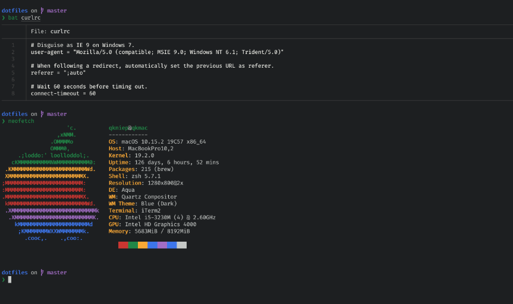
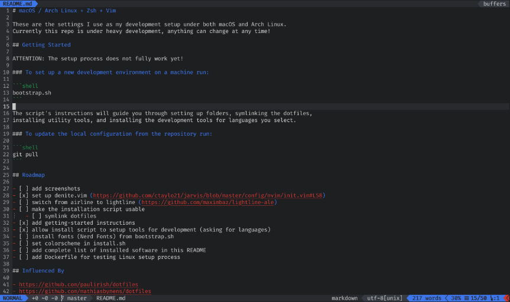

# macOS / Arch Linux (i3) + Alacritty + Zsh + Vim

I use this as my development setup under both macOS and Arch Linux.
Currently this repo is under heavy development, anything can change at any time!

 | 
-------------------- | --------------------

## Getting Started

ATTENTION: The setup process does not fully work yet!

### To set up a new development environment on a machine run:

```shell
bootstrap.sh
```

The script's instructions will guide you through setting up folders, symlinking the dotfiles,
installing utility tools, and installing the development tools for languages you select.

### To update the local configuration from the repository run:

```shell
git pull
```

## Roadmap

- [x] set up denite.vim (https://github.com/ctaylo21/jarvis/blob/master/config/nvim/init.vim#L58)
- [ ] make the installation script usable
	- [ ] symlink dotfiles
- [ ] improve documentation (especially for update process)
- [x] allow install script to setup tools for development (asking for languages)
- [x] install fonts (Nerd Fonts) from bootstrap.sh
- [ ] set colorscheme in install.sh
- [ ] add complete list of installed software in this README
- [ ] add Dockerfile for testing Linux setup process
- [ ] switch from airline to lightline? (https://github.com/maximbaz/lightline-ale)

## Influenced By

- https://github.com/donnemartin/dev-setup
- https://github.com/paulirish/dotfiles
- https://github.com/mathiasbynens/dotfiles
- https://github.com/skwp/dotfiles
- https://github.com/holman/dotfiles
- https://github.com/thoughtbot/dotfiles

## License

Released under the [MIT License](LICENSE).
