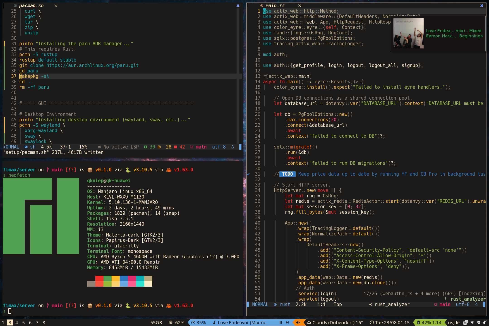

# My Dev Setup

<p>
	
	
	
	
	
	
</p>

I use this as my development setup under both macOS and Manjaro Linux, though I am currently exploring NixOS and consider moving from Manjaro back to Arch.
Currently this repo is under heavy development, anything can change at any time!



## Getting Started

ATTENTION: The setup process does not fully work yet!

If you decide to use this on your own system, I recommend you fork the repo.
This way you can use the setup with symlinks into the git directory
and are able to push changes to your own fork of the repository.

### To set up a new development environment on a machine run:

```shell
./bootstrap.sh
```

The script's instructions will guide you through setting up folders, symlinking the dotfiles,
installing utility tools, and installing the development tools for languages you select.

### To update the local configuration from the repository run:

```shell
git pull
```

## Roadmap

- [ ] make the installation script usable
	- [ ] symlink/sync dotfiles
- [ ] improve documentation (especially for update process)
- [ ] add complete list of installed software in this README
- [ ] add Dockerfile for testing Linux setup process

## Influenced By

Also check out the dotfiles of these awesome people:

- https://github.com/folke/dot
- https://github.com/jdhao/nvim-config
- https://github.com/donnemartin/dev-setup
- https://github.com/paulirish/dotfiles
- https://github.com/mathiasbynens/dotfiles
- https://github.com/skwp/dotfiles
- https://github.com/holman/dotfiles
- https://github.com/thoughtbot/dotfiles
- https://github.com/HynDuf7/dotfiles

## License

Released under the [MIT License](LICENSE).
